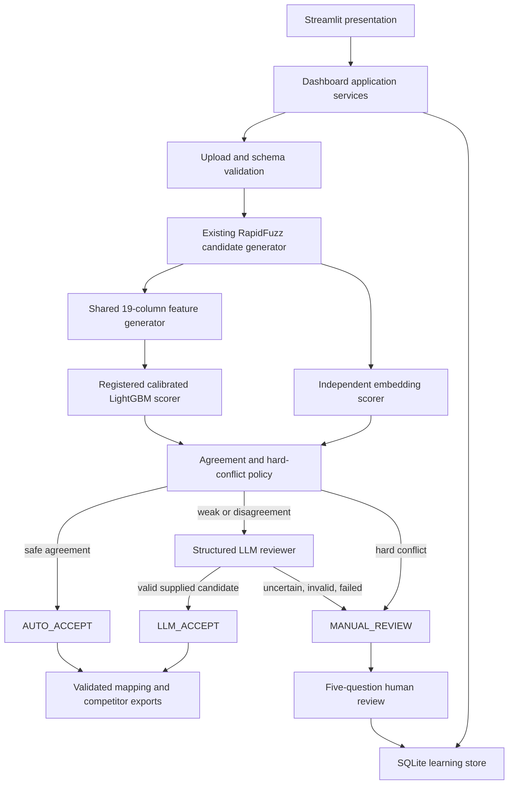
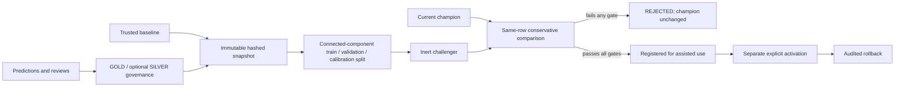

# Architecture Overview

## Safety posture

The system is assisted inference plus governed review-data collection. It is
not autonomous self-learning, and it is not approved for automatic production
matching. The `0.85` operational boundary is configuration-owned and recorded
as `threshold_source=user_configured` with
`production_threshold_approved=false`.

## Runtime architecture

LightGBM and the embedding scorer consume the same retained candidate rows.
The embedding scorer cannot generate, add, remove, or reorder candidates. The
LLM can only accept a supplied candidate, reject all supplied candidates, or
return uncertain.

## Layer boundaries

| Layer | Location | Responsibility |
| --- | --- | --- |
| Presentation | `dashboard/Dashboard.py`, `dashboard/pages`, `dashboard/components` | Render controls, status, and downloads; hold only transient navigation state. |
| Application services | `dashboard/services` | Validate/stage uploads, orchestrate reusable services, persist runs, expose review and download operations. |
| Domain | `src/sku_mapping` | Candidate generation, shared features, scorers, policies, exports, learning governance, retraining. |
| Persistence | `src/sku_mapping/learning`, cache modules, model registry | SQLite records, version-isolated caches, immutable package/registry metadata. |

Core domain code has no Streamlit dependency. Streamlit pages do not implement
candidate, feature, model, agreement, LLM, competitor, export, or retraining
business logic.

## Mode isolation

- `disabled` returns the existing input object and creates no modular inference
  output.
- `shadow` performs observational scoring and returns production-owned rows
  unchanged.
- `assisted` applies only the explicit final policy.

Only `AUTO_ACCEPT` and valid `LLM_ACCEPT` rows set
`final_eligible_mapping=true`. Competitor discovery checks both that flag and
the allowed final decision. Manual-review rows cannot silently become accepted
mappings.

## Feature and package contract

Training and inference both import:

- `MODEL_FEATURE_COLUMNS` from `sku_mapping.constants`;
- `build_feature_vector` and `build_feature_vector_from_text` from the shared
  feature package.

Model input is the exact ordered 19-column numeric frame. Raw offer text,
labels, source identifiers, and provenance columns are not model inputs.
Package loading checks feature order, fitted prediction interfaces,
calibration state, package identity, dataset/split hashes, feature-generator
version, and Python/LightGBM/scikit-learn compatibility.

Model saves and registry writes use temporary files plus atomic replacement
where practical. Challengers use new paths and cannot overwrite the champion.

## Caches and local providers

Embedding cache identity contains normalized prepared text, embedding model
ID, and embedding model version.

LLM cache identity contains the canonical structured request hash, LLM model
ID, prompt version, and response-schema version. Responses cannot be reused
across model, prompt, or schema versions.

The preferred embedding model and default LLM endpoint are free and local.
Both are lazy, optional, disabled by default, and fail closed.

## Learning and retraining

Inference and dashboard processing contain no fit or retraining call. Snapshot
creation defaults to at least 50 new real GOLD labels. PSEUDO labels are
excluded; SILVER is disabled unless explicitly enabled and then receives a
lower configured weight.

Routine training and evaluation call the sealed-challenge guard before opening
input artifacts. Phase 8 did not open a sealed challenge set.

## Legacy compatibility

`sku_mapping_pipeline_ml.py` remains the authoritative legacy production entry
point. It is intentionally executed as a script and retains legacy data/model
loading behavior. Import-safe modular services are used by the dashboard,
tests, training workflows, and dry-run CLIs; they do not import the monolith.
